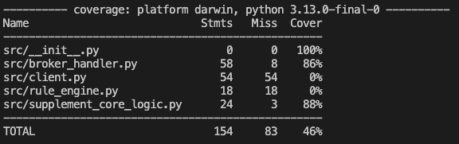

# Winter Supplement Eligibility Calculator

## Overview
This project is a Winter Supplement Eligibility Calculator that checks if clients are eligible and calculates their benefits based on set rules. It uses an event-driven setup with an MQTT broker for message handling.

---

### Setting Up the Environment

Clone the Repository:
```bash
https://github.com/DSavani-98/Winter_Supplement_Calculator-Rule_Engine.git
cd <Winter_Supplement_Calculator-Rule_Engine>
```

### Prerequisites:

•	Python 3.8 or higher
•	Internet connection for MQTT broker communication
•	Git for cloning the repository


### Setting Up the Environment and Application:
```bash
python -m venv .venv
source .venv/bin/activate  # Linux/Mac
.venv\Scripts\activate     # Windows
```


Install Dependencies:
```bash
pip install -r requirements.txt
```

Set Environment Variables:
```bash
	Copy .env:
	cp .env.example .env
```
<br>

	Update MQTT_TOPIC_ID and other variables in the .env file if necessary.

### How to Run broker Handler and Client services:

#### MQTT TOPIC ID ####
This is the MQTT Topic Id that we will be subcribing to. You update the ID inside `.env` file.
```bash
MQTT_TOPIC_ID=7e5f7e29-d39a-48fe-8e3c-7f44167cd49b
```  
#### Note: This step is not necessary to perform ####
<br>


#### Start the Rule Engine:
This connects to the MQTT broker, subscribes to the input topic ID, and dynamically processes and displays evaluated response for incoming requests.
```bash
python src/rule_engine.py
```
<br>


#### Run the Client Interface:
This will allow user to use interactive CLI to enter custom values for calculating the Winter Supplement. This tool allows manual testing of the rule engine.
```bash
python src/client.py
```

<br>

#### Sending request to broker in json format:
Using secon Terminal window we can direltly send the request data into JSON format to the broker server and will be able to see evaluated response from subscribed broker on the rule_engine terminal.
```bash
mosquitto_pub -h test.mosquitto.org -p 1883 -t "BRE/calculateWinterSupplementInput/7e5f7e29-d39a-48fe-8e3c-7f44167cd49b" -m '{"id": "WS001", "numberOfChildren": 2, "familyComposition": "single", "familyUnitInPayForDecember": true}'
```
<br>


### Executing Tests:

#### Performing Unit Tests:
Using below command we will be able to itreate though all the test cases inside test_broker_handler.py and test_supplement_core_logic.py. and will also display result for each test case if PASSED OR FAILED .
```bash
pytest -v --color=yes
```
<br>


#### Generating Coverage Report for Tests:
This command runs all unit tests and generates a coverage report. below is the screenshot for the coverage report.
```bash
pytest --cov=src tests/
```


<br>


### Demo Clips:

#### 1. Establishing Connection with the MQTT Broker:
Demonstrates the process of connecting the application to the MQTT broker and passing data in the exact JSON format received from the web application.

<video controls src="media/recording_1.mp4" title="Title"></video>
		

#### 2. Interactive Testing with Step-by-Step User Input:
Showcases an additional feature that imitates user input step by step. This feature facilitates better usability and allows for manual testing of the application.

<video controls src="media/recording_2.mp4" title="Title"></video>
	
#### 3.	Executing All Tests:
Displays the process and successful execution of tests with results. 

<video controls src="media/testRecording_1.mp4" title="Title"></video>


#### 4.	Running Tests with Coverage Report:
Illustration of generated coverage report for running tests with the coverage command:

<video controls src="media/testRecording_2.mp4" title="Title"></video>
