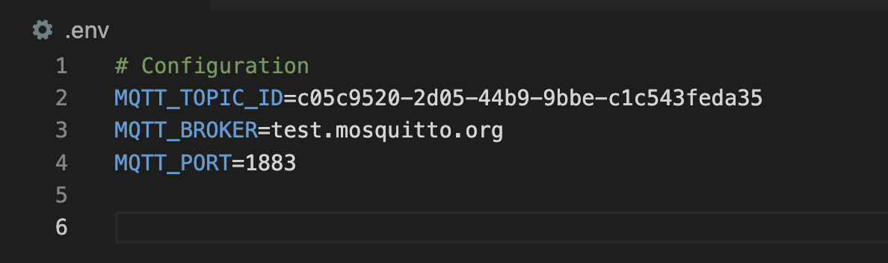

# Winter Supplement Eligibility Calculator

## Overview
This project is a Winter Supplement Eligibility Calculator that checks if clients are eligible and calculates their benefits based on set rules. It uses an event-driven setup with an MQTT broker for message handling.

---

### Setting Up the Environment
Follow these steps to prepare the environment for hosting the Winter Supplement Rule Engine:

#### 1. Clone the Repository

Run the following command to clone the project repository:
```bash
git clone https://github.com/DSavani-98/Winter_Supplement_Calculator-Rule_Engine.git
```

#### 2. Navigate to the Project Directory

Move into the root directory of the project:
```bash
cd Winter_Supplement_Calculator-Rule_Engine
```

#### 3. Create a Virtual Environment
Set up a virtual environment using the command below:
```bash
python3 -m venv .venv
```

#### 4. Activate the Virtual Environment
**Linux/Mac:**
```bash
source ./.venv/bin/activate
```
**Windows (Command Prompt)**
```bash
.venv\Scripts\activate
```
#### 5. Install Dependencies
Install all necessary dependencies in the virtual environment:
```bash
pip install -r requirements.txt
```

#### 6. Add the Project Directory to Python Path
Update the Python path within the virtual environment to recognize subdirectories as packages:

**Linux/Mac:**
```bash
export PYTHONPATH=$(pwd)
```
**Windows (Command Prompt)**
```bash
set PYTHONPATH=%cd%
```

#### 7. Create a .env
Use sample environment variable file (.env.example) to generate the .env file:
**Linux/Mac:**
```bash
cp .env.example .env
```
**Windows (Command Prompt)**
```bash
copy .env.example .env
```
Your environment is now ready to use.

---
<br>

### How to Update MQTT Topic ID to Receive Client JSON?

To update the MQTT Topic ID that the system subscribes to, modify the environment variable holding the MQTT Topic ID in the `.env` file.

1. Log in to the [Winter Supplement Calculator](https://winter-supplement-app-d690e5-tools.apps.silver.devops.gov.bc.ca/) web client using the provided user credentials. The web client interface should appear as shown below:  
   

2. Copy the MQTT Topic ID from the web client.

3. Open the `.env` file and replace the existing sample MQTT Topic ID with the actual one. The updated `.env` file should resemble the following:  
   

---
<br>

### How to Run broker Handler and Client services:

#### Start the Rule Engine:
The rule engine connects to the MQTT broker, subscribes to the input topic ID, and dynamically processes and displays evaluated response for incoming requests.
```bash
python src/rule_engine.py
```
<br>


#### Run the Client Interface:
The client Interface will allow user to use interactive CLI to enter custom values for calculating the Winter Supplement. This tool allows manual testing of the rule engine.
```bash
python src/client.py
```

<br>

#### Sending request to broker in json format:
Using another Terminal window we can directly send the request data into JSON format to the broker server and will be able to see evaluated response from subscribed broker on the rule_engine terminal.
```bash
mosquitto_pub -h test.mosquitto.org -p 1883 -t "BRE/calculateWinterSupplementInput/7e5f7e29-d39a-48fe-8e3c-7f44167cd49b" -m '{"id": "WS001", "numberOfChildren": 2, "familyComposition": "single", "familyUnitInPayForDecember": true}'
```

---
<br>

### Executing Tests:

#### Performing Unit Tests:
Using below command we will be able to itreate though all the test cases inside test_broker_handler.py and test_supplement_core_logic.py. and will also display result for each test case if PASSED OR FAILED .
```bash
pytest -v --color=yes
```
<br>


#### Generating Coverage Report for Tests:
The below mentioned command runs all unit tests and generates a coverage report. below is the screenshot for the coverage report.
```bash
pytest --cov=src tests/
```


The 0% coverage for client.py and rule_engine.py is a good practice as it demonstrates the isolation of testing components, ensuring only dedicated test files are executed during testing.

---
<br>

### Demo Clips:

#### 1. Establishing Connection with the MQTT Broker:
Demonstrates the process of connecting the application to the MQTT broker and passing data in the exact JSON format received from the web application.


---	

#### 2. Interactive Testing with Step-by-Step User Input:
Showcases an additional feature that imitates user input step by step. This feature facilitates better usability and allows for manual testing of the application.


---
#### 3.	Executing All Tests:
Displays the process and successful execution of tests with results. 


---
#### 4.	Running Tests with Coverage Report:
Illustration of generated coverage report for running tests with the coverage command:


---
<br>

### Prerequisites:

 - Python: Version 3.8 or higher
 - Internet connection: Required for MQTT broker communication and building dependacies
 - Git: Needed to clone the project repository
---
<br>

### NOTE:

For more details about the rule engine and testing component, check the following resources:

- **[rule engine README.md](src/README.md)**

- **[tests README.md](tests/README.md)**

